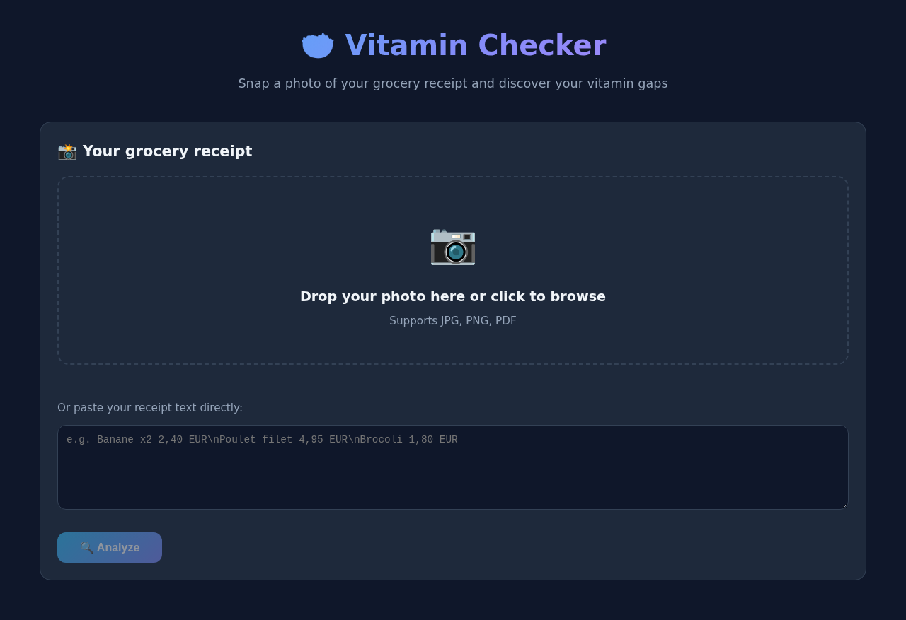
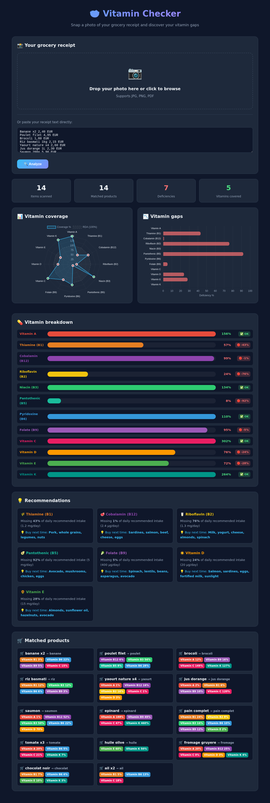

# 🥗 Vitamin Checker

**Snap a photo of your grocery receipt and instantly discover your vitamin gaps.**

> 🌐 **Try it live:** [https://paul-sandbox.duckdns.org/vitaminchecker/](https://paul-sandbox.duckdns.org/vitaminchecker/)

Vitamin Checker uses OCR to scan supermarket receipts, identifies food items, and maps them against a nutritional database covering 12 essential vitamins. It then generates an interactive dashboard showing which vitamins you're getting enough of — and which you're missing.


## 📸 Screenshots

### Landing Page



Upload your receipt photo or paste the text directly, then click Analyze.

### Analysis Results



Interactive dashboard with radar chart, gap analysis, vitamin breakdown, personalized recommendations, and per-product nutrient details.

## ✨ Features

- **📸 Photo upload** — Drag-and-drop or click to upload a receipt image (JPG, PNG, PDF)
- **🔍 OCR scanning** — Automatic text extraction from receipt photos using Tesseract (French + English)
- **🧠 Smart matching** — Fuzzy matching of OCR'd product names against 100+ food items
- **📊 Interactive dashboard** — Radar chart, bar chart, and progress bars for 12 vitamins
- **💡 Recommendations** — For each deficiency, suggests specific foods to buy next time
- **🛒 Product breakdown** — Shows each matched item and its vitamin contributions
- **🎨 Dark theme** — Clean, modern UI with smooth animations

## 🩺 Vitamins Tracked

| Vitamin | Name | RDA | Unit |
|---------|------|-----|------|
| A | Vitamin A | 900 | µg |
| B1 | Thiamine | 1.2 | mg |
| B2 | Riboflavin | 1.3 | mg |
| B3 | Niacin | 16 | mg |
| B5 | Pantothenic Acid | 5 | mg |
| B6 | Pyridoxine | 1.7 | mg |
| B9 | Folate | 400 | µg |
| B12 | Cobalamin | 2.4 | µg |
| C | Vitamin C | 90 | mg |
| D | Vitamin D | 20 | µg |
| E | Vitamin E | 15 | mg |
| K | Vitamin K | 120 | µg |

## Quick Start

### Option 1: Docker (Recommended)

No need to install Python or Tesseract -- everything runs in a container.

```bash
# Clone the repo
git clone https://github.com/BuildWithPaul/VitaminChecker.git
cd VitaminChecker

# Build and run with Docker Compose
docker compose up --build
```

Or with plain Docker:

```bash
docker build -t vitamin-checker .
docker run -p 5000:5000 vitamin-checker
```

Open [http://localhost:5000](http://localhost:5000) in your browser.

### Option 2: Manual Install

#### Prerequisites

- Python 3.10+
- [Tesseract OCR](https://github.com/tesseract-ocr/tesseract) (for receipt image scanning)
- French language pack for Tesseract (`tesseract-ocr-fra`)

#### Install

```bash
# Clone the repo
git clone https://github.com/BuildWithPaul/VitaminChecker.git
cd VitaminChecker

# Install Python dependencies
pip install -r requirements.txt

# Install Tesseract OCR (Ubuntu/Debian)
sudo apt-get install tesseract-ocr tesseract-ocr-fra

# Install Tesseract OCR (macOS with Homebrew)
brew install tesseract tesseract-lang

# Install Tesseract OCR (Windows)
# Download from https://github.com/UB-Mannheim/tesseract/wiki
```

#### Run

```bash
python3 app.py
```

Open [http://localhost:5000](http://localhost:5000) in your browser.

## 📁 Project Structure

```
vitamin-checker/
├── app.py                  # Flask backend (routes, OCR, nutrition analysis)
├── requirements.txt        # Python dependencies
├── Dockerfile              # Container definition (Python + Tesseract)
├── docker-compose.yml      # Local dev (Flask only, port 5000)
├── .dockerignore           # Build exclusions
├── templates/
│   └── index.html          # Frontend (single-page app with Chart.js)
├── static/
│   └── app.js              # Client-side logic (upload, charts, API calls)
├── uploads/                # Uploaded receipt images (auto-created)
├── images/                 # Screenshots for README
│   ├── landing.png         # Landing page screenshot
│   └── results.png         # Analysis results screenshot
├── deploy/                 # Production deployment (Caddy + HTTPS)
│   ├── Caddyfile           # Caddy reverse proxy config
│   ├── docker-compose.prod.yml  # Production compose (Flask + Caddy)
│   └── DEPLOY-GUIDE.md     # Full deployment walkthrough
└── README.md
```

## 🔧 How It Works

1. **Upload** — You upload a photo of your grocery receipt
2. **OCR** — Tesseract extracts text from the image (French + English)
3. **Parse** — The receipt parser strips prices, weights, barcodes, and noise, leaving only product names
4. **Match** — Each product name is fuzzy-matched against the nutrition database
5. **Analyze** — Vitamin contributions are summed across all matched items and compared against RDA values
6. **Visualize** — Results are rendered as interactive charts and progress bars

### Receipt Parsing Pipeline

```
Raw OCR text
  → Strip prices (€, EUR, decimal amounts)
  → Strip weights/units (kg, g, ml, L, 500G, etc.)
  → Strip metadata (store name, VAT, card info, totals)
  → Remove short/numeric-only fragments
  → Lowercase + clean special characters
  → Fuzzy match against food database
```

## 🗄️ Nutrition Database

The `FOOD_VITAMINS` dictionary maps **100+ food items** (in French, matching typical supermarket receipts) to their vitamin content as **% of RDA per 100g**. Categories include:

- 🍎 Fruits (orange, banana, kiwi, strawberry, mango, etc.)
- 🥬 Vegetables (carrot, broccoli, spinach, tomato, pepper, etc.)
- 🥩 Meat & Fish (chicken, beef, salmon, tuna, sardines, etc.)
- 🥛 Dairy (milk, yogurt, cheese, butter, cream)
- 🥚 Eggs
- 🍞 Grains (bread, rice, pasta, oats, quinoa)
- 🥜 Nuts & Seeds (almonds, walnuts, hazelnuts, peanuts, sunflower)
- 🫘 Legumes (lentils, beans, chickpeas, peas)
- 🧊 Prepared foods (pizza, soup, quiche, lasagna)
- 🍫 Treats (chocolate, jam)
- 🧂 Oils & Condiments (olive oil, mustard, ketchup)
- 🍷 Drinks (juice, beer, coffee, tea)

## ⚙️ Configuration

### Change the port

```python
# In app.py, last line:
app.run(debug=True, host='0.0.0.0', port=5000)  # Change port here
```

### Add new foods

Add entries to the `FOOD_VITAMINS` dictionary in `app.py`:

```python
"avocado": {"K": 20, "B5": 14, "B6": 13, "B9": 20, "E": 10, "C": 15},
```

Values are **% of RDA per 100g**. For example, avocado provides 20% of your daily Vitamin K per 100g.

## Docker

### Development mode

To run with Flask's auto-reloading dev server instead of gunicorn:

```bash
docker compose run --rm -p 5000:5000 vitamin-checker python app.py
```

Or override the CMD in docker-compose.yml:

```yaml
    command: ["python", "app.py"]
```

### Production deployment

The container uses **gunicorn** (2 workers, 120s timeout) by default. Deploy with:

```bash
docker compose up -d
```

Uploaded receipts are persisted via the `./uploads` volume mount.

### Custom port

```bash
docker run -p 8080:5000 vitamin-checker
```

Or edit the port mapping in `docker-compose.yml`.

### HTTPS with auto-renewing certificate (Caddy)

Deploy behind [Caddy](https://caddyserver.com/) for automatic HTTPS with Let's Encrypt. Certificates are obtained and renewed automatically — no certbot, no cron.

```bash
git clone https://github.com/BuildWithPaul/VitaminChecker.git ~/vitaminchecker
cd ~/vitaminchecker

# Edit deploy/Caddyfile — replace paul-sandbox.duckdns.org with your domain
# Edit deploy/docker-compose.prod.yml — adjust APPLICATION_ROOT if not using /vitaminchecker

docker compose -f deploy/docker-compose.prod.yml up -d --build
```

Your app is now live at `https://paul-sandbox.duckdns.org/vitaminchecker/` with auto-renewing HTTPS.

All production deploy files live in the `deploy/` folder:

| File | Purpose |
|------|---------|
| `deploy/Caddyfile` | Caddy config — domain, subpath, reverse proxy |
| `deploy/docker-compose.prod.yml` | Production compose — Flask + Caddy containers |

> **Prerequisites:** DNS pointing to your VPS, ports 80/443 open.
> **Root path:** Remove the `redir /` line and change `handle_path /vitaminchecker/*` to `handle` if hosting at root.

## Notes

- Vitamin values are approximate and based on standard nutritional data for 100g portions. Actual values vary by brand, ripeness, and preparation method.
- OCR quality depends on photo clarity, lighting, and receipt font. Blurry or crumpled receipts may produce lower match rates.
- The nutrition database uses French product names since it was originally designed for French supermarket receipts. Add English names as needed in the `FOOD_VITAMINS` dictionary.

## 📜 License

MIT License — see [LICENSE](LICENSE) for details.

---

Built with Flask, Chart.js, Tesseract OCR, and Python 🐍